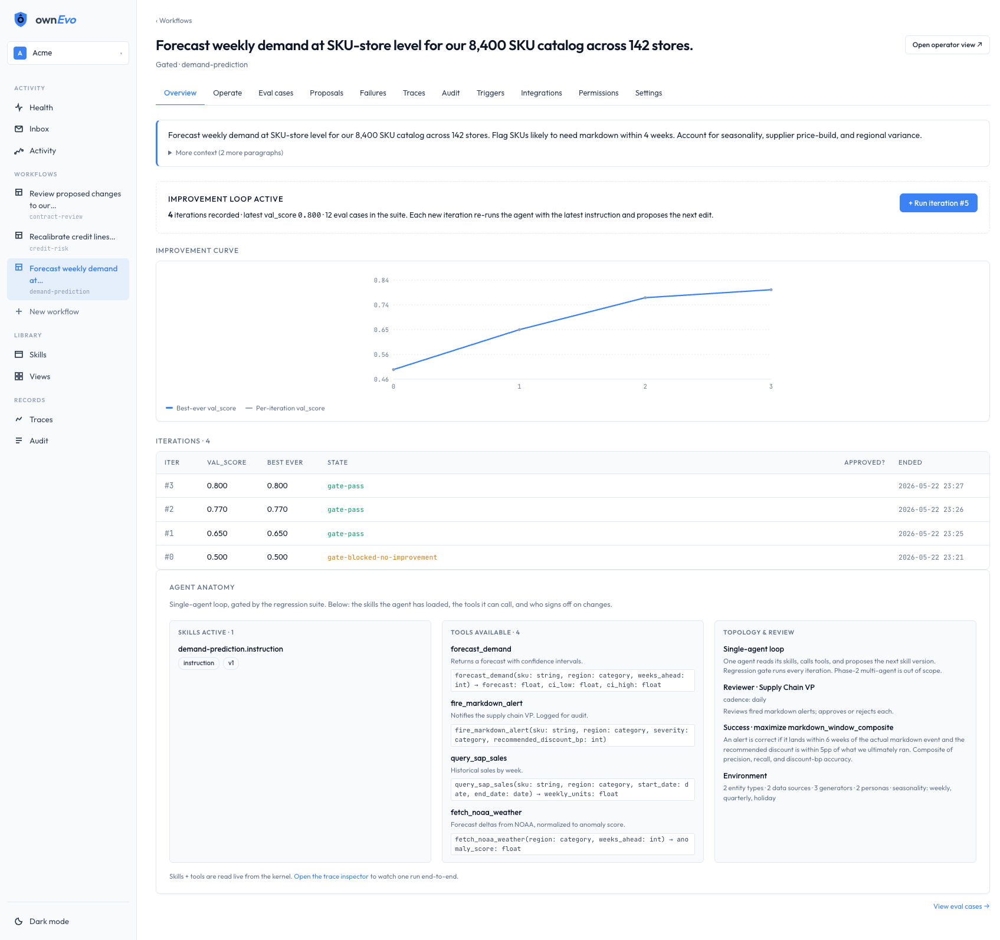
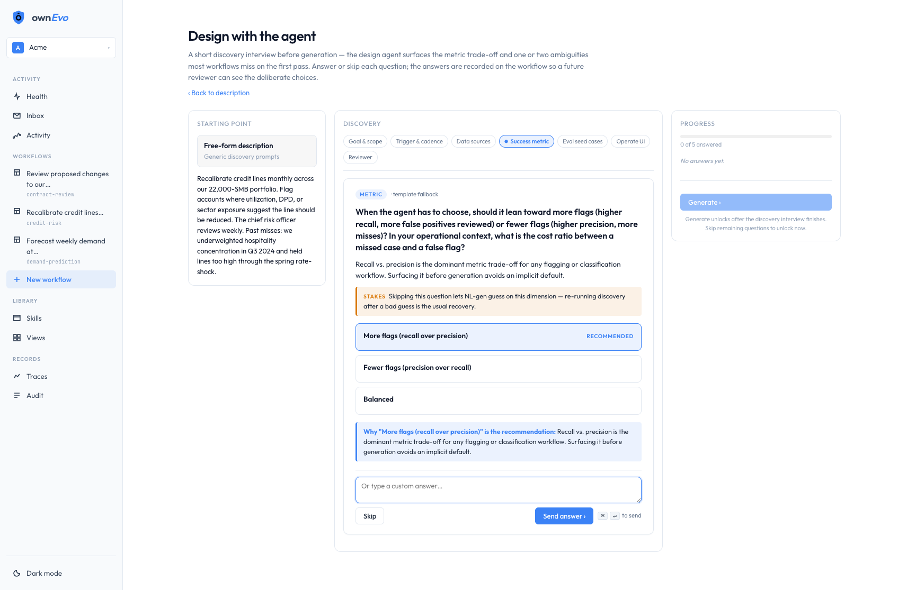
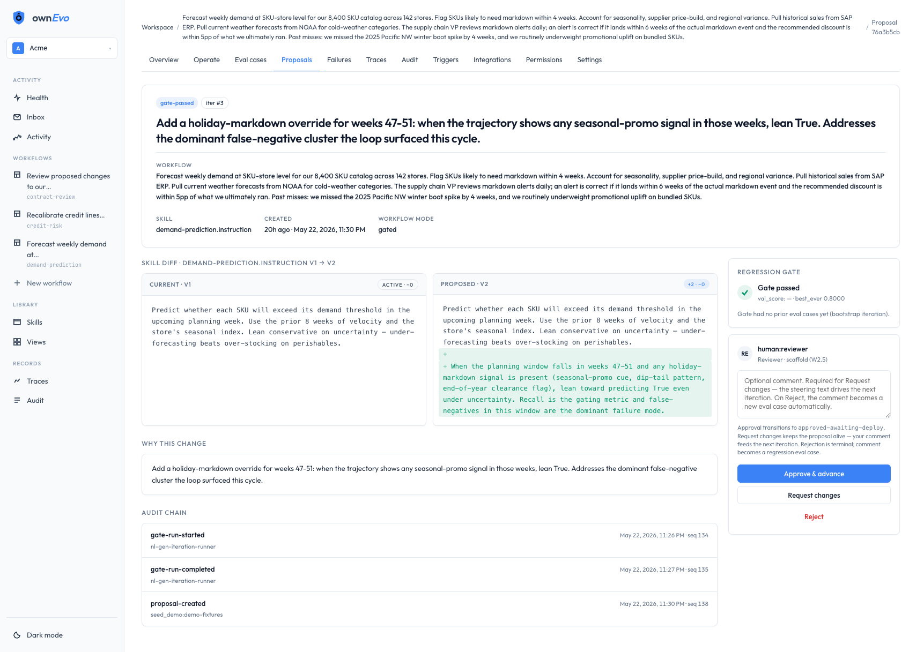
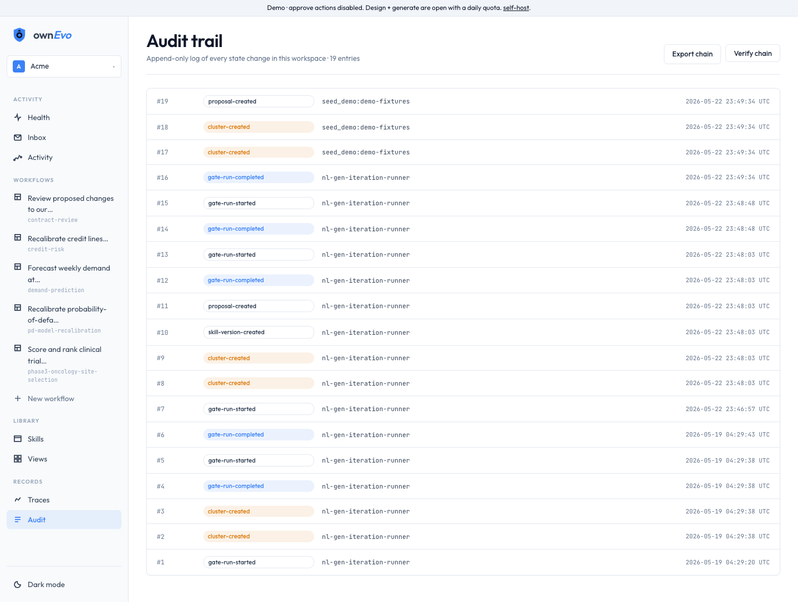

<p align="center">
  <a href="https://ownevo.ai">
    
  </a>
</p>

<h1 align="center">ownEvo</h1>

<p align="center">
  <strong>The improvement loop for core agents.</strong>
</p>

<p align="center">
  Every production failure becomes an eval case.<br>
  Every proposed fix is regression-tested against every prior fix.<br>
  A domain expert approves the change in plain language.
</p>

<p align="center">
  <a href="https://demo.ownevo.ai">Live demo</a> ·
  <a href="#quick-start">Quick start</a> ·
  <a href="docs/ARCHITECTURE.md">Architecture</a> ·
  <a href="CHANGELOG.md">Changelog</a> ·
  <a href="https://ownevo.ai">ownevo.ai</a>
</p>

---

## What it does

```
   Agent runs a workflow
            ↓
   AgentEvent traces collected
            ↓
   Failures clustered into eval cases
            ↓
   Loop proposes a skill edit
            ↓
   Regression gate (every prior fix runs)
            ↓
   Domain expert approves in plain language
            ↓
   Deploy · audit chain extends
```

Two processes joined by REST + SSE:

- **Python kernel** — agent runtime, eval harness (Inspect AI), failure clustering (sentence-transformers + UMAP + HDBSCAN), regression gate, sandboxed code execution.
- **Next.js web** — workspace UI, side-by-side diff, lift chart, audit trail, approval queue.

Detailed system tour: [`docs/ARCHITECTURE.md`](docs/ARCHITECTURE.md).

## What the domain expert actually sees

Captured from a local `make seed-demo-with-iter` run — no editing, no mockup layer.

**Workflow overview** — plain-English description, the improvement curve (val_score climbing 0.46 → 0.65 → 0.77 → 0.80 across four iterations of `demand-prediction` — iter #0 gate-blocked, iters #1–3 gate-passed), recorded iterations, and the agent's anatomy (skills, tools, reviewer, success metric) on a single page.

<p align="center">
  
</p>

**Design with the agent** — a short discovery interview before generation. The design agent surfaces the metric trade-off and one or two ambiguities most workflows miss on the first pass, grounded in the operator's own description. Answers become hard constraints on the four generated artifacts (spec, simulation plan, success metric, eval seed cases).

<p align="center">
  
</p>

**Proposal review** — side-by-side skill diff (V1 → V2), why-this-change rationale, the regression gate's verdict, and the audit-chain entries that produced the proposal. Approve / Request changes / Reject are the three terminal decisions; the comment box on Request changes becomes the steering text for the next iteration.

<p align="center">
  
</p>

**Audit chain** — append-only log of every state change in the workspace. SHA-256-hash-chained at the DB level; export as canonical JSON in one click; verify the chain end-to-end via the kernel.

<p align="center">
  
</p>

## Quick start

```bash
./scripts/setup.sh                          # one-shot: uv + node + .env from .env.example
echo 'ANTHROPIC_API_KEY=sk-ant-...' >> .env # add your Anthropic key
make dev-up                                 # build + start postgres + kernel + web
make seed-demo-with-iter                    # seed two workflows + run one iteration
```

- Kernel API: <http://localhost:8000/api/health>
- Web app: <http://localhost:3000/workspaces/acme>

`make dev-down` to stop. `make smoke` to verify the stack. `make doctor` to preflight before deploying. `make help` for the common targets, `make help-all` for everything.

Prefer not to build from source? Pre-built images are published to GHCR on
every release — `ghcr.io/ownevoai/ownevo-kernel` and `…/ownevo-web` — and run
on the same compose file:

```bash
export OWNEVO_KERNEL_IMAGE=ghcr.io/ownevoai/ownevo-kernel:latest
export OWNEVO_WEB_IMAGE=ghcr.io/ownevoai/ownevo-web:latest
docker compose pull
ANTHROPIC_API_KEY=sk-ant-... docker compose up -d --no-build
```

Full deployment options — local, Docker Compose, published images, Fly.io: [`docs/DEPLOYMENT.md`](docs/DEPLOYMENT.md). One-shot Fly.io deploy: `make fly-bootstrap`.

## Repo layout

```
apps/kernel/      Python — runtime, eval, clustering, gate, baselines, sandbox
apps/web/         Next.js — workspace UI, approval queue, diff viewer
packages/         Shared schemas (trace-format)
docs/             Architecture, schema, skill format, runbooks
infra/            Docker compose + LiteLLM proxy config
```

## Docs

| Topic | Read |
|---|---|
| System tour | [`docs/ARCHITECTURE.md`](docs/ARCHITECTURE.md) |
| Database schema | [`docs/SCHEMA.md`](docs/SCHEMA.md) |
| Skill format + retention contract | [`docs/SKILL_FORMAT.md`](docs/SKILL_FORMAT.md) |
| State machines (proposal lifecycle) | [`docs/STATE_MACHINES.md`](docs/STATE_MACHINES.md) |
| Improvement-loop design rules | [`docs/HARNESS.md`](docs/HARNESS.md) |
| Multi-benchmark substrate | [`docs/BENCHMARK_ARCHITECTURE.md`](docs/BENCHMARK_ARCHITECTURE.md) |
| Trace-format spec | [`packages/trace-format/SPEC.md`](packages/trace-format/SPEC.md) |
| Local LLM backends (Ollama / LM Studio) | [`docs/local-model-testing.md`](docs/local-model-testing.md) |
| Deployment | [`docs/DEPLOYMENT.md`](docs/DEPLOYMENT.md) |
| REST + SSE API | [`docs/api/openapi.yaml`](docs/api/openapi.yaml) |

## Status

See [`CHANGELOG.md`](CHANGELOG.md) for releases and roadmap.

## License

- **`apps/`, `docs/`, `infra/`, root** — [Business Source License 1.1](LICENSE), converting to Apache 2.0 four years after each release. An Additional Use Grant permits production use except as a hosted competing service.
- **`packages/trace-format/`** — [Apache 2.0](packages/trace-format/LICENSE). The trace schema is meant to be a standard; use it everywhere.

## Contributing

Issues and discussion are welcome. For pull requests: keep them focused, run `make test` and `make lint`, and avoid mixing refactors with feature changes.
