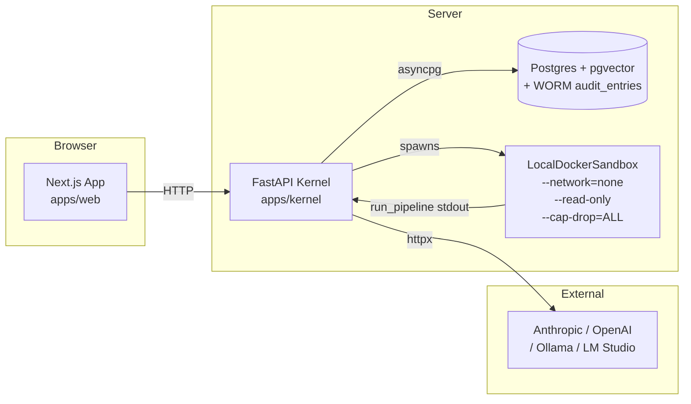
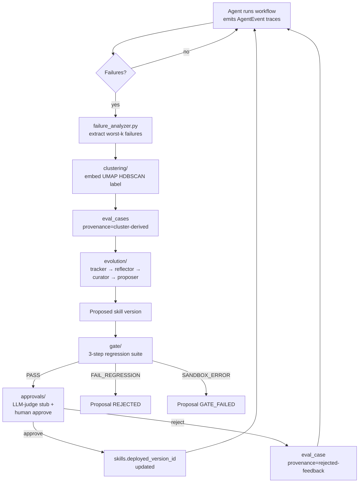
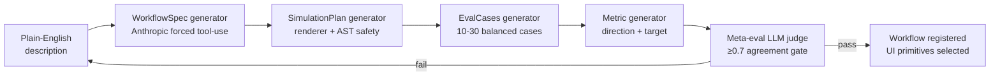
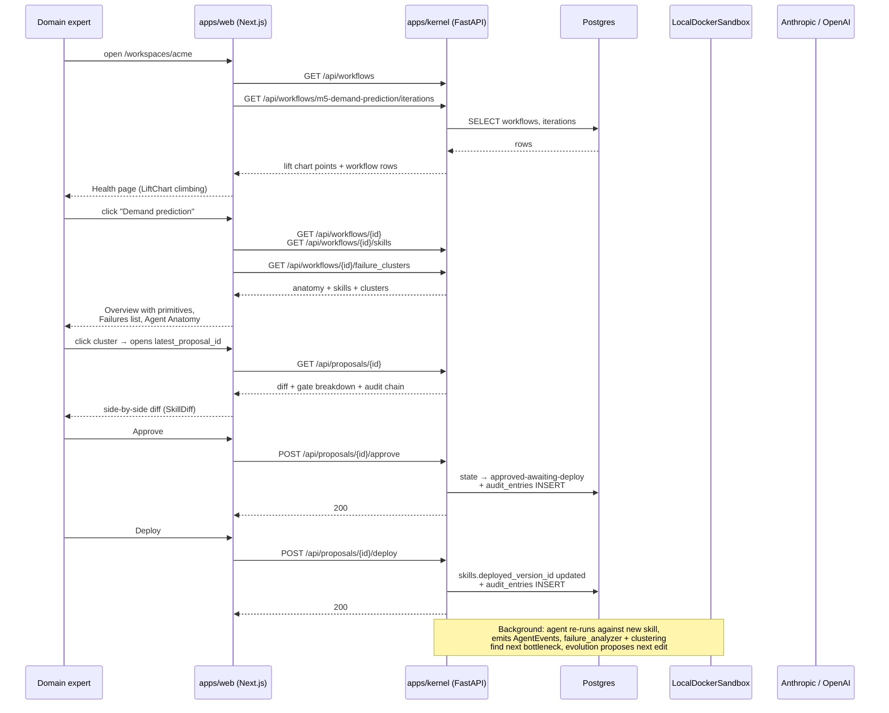

# ownEvo — Architecture

**Status:** living doc. Update whenever a structural change ships.
**Authority:** when this doc disagrees with code, code wins — update this doc to match.

This is the one-document tour. For deep dives:

| Topic | Doc |
|---|---|
| Database schema | [`SCHEMA.md`](SCHEMA.md) (authoritative: `apps/kernel/migrations/0001_substrate.sql`) |
| Proposal / iteration state machines | [`STATE_MACHINES.md`](STATE_MACHINES.md) |
| Improvement-loop harness design rules | [`HARNESS.md`](HARNESS.md) |
| Multi-benchmark substrate (M5 + τ³) | [`BENCHMARK_ARCHITECTURE.md`](BENCHMARK_ARCHITECTURE.md) |
| Skill format + retention contract | [`SKILL_FORMAT.md`](SKILL_FORMAT.md) |
| AgentEvent trace schema | [`../packages/trace-format/SPEC.md`](../packages/trace-format/SPEC.md) |
| Local LLM backends (Ollama / LM Studio) | [`local-model-testing.md`](local-model-testing.md) |
| Deployment | [`DEPLOYMENT.md`](DEPLOYMENT.md) |

---

## 1. Two processes, one seam

ownEvo is **two processes connected by REST + SSE.**



**Why two processes:** the Python kernel implements the core algorithms (improvement loop, eval harness, failure clustering, regression gate). The TypeScript/Next app drives the product surface (approval UX, diff viewer, lift chart, audit trail). The clustering ecosystem is Python-first at the quality bar required; the web UI is unavoidably TS/Next. Joining the two with REST + SSE keeps the boundary honest.

**Why Postgres + pgvector:** one substrate for relational state (workflows, skills, proposals, audit) AND vector search over failure embeddings. Avoids dual-write between OLTP and a vector store.

**Why local Docker sandbox:** agent-generated code runs there with the hardening listed above. Phase-2 swap to e2b / Modal is a one-file change behind the `SandboxRuntime` Protocol.

---

## 2. The improvement loop — the core engine

Every production failure becomes an eval case, every proposed fix is regression-tested against every prior fix, a domain expert approves changes in plain language.



**Key invariants:**
- Every state transition writes an `audit_entries` row. Append-only at the DB level (`REVOKE UPDATE, DELETE` from the app role; only `INSERT` permitted).
- `eval_cases` are the durable substrate — they accumulate over time and define the regression suite. They are what makes the "every prior fix is regression-tested" claim load-bearing.
- The 3-step gate maps `FAIL_REGRESSION` and `FAIL_NO_IMPROVEMENT` to `ProposalState.REJECTED`; only `SANDBOX_ERROR` maps to `GATE_FAILED`. UI conditionals must check both.

---

## 3. NL-generation — describe → workflow

Domain experts type a description; the platform generates a runnable workflow.



The four artifacts are **discriminated unions**: each typed (Pydantic schemas in `packages/trace-format/` and `apps/kernel/src/ownevo_kernel/nl_gen/`), `extra="forbid"`, `frozen=True`. The seam is the schema; the prompts are best-effort.

The `WorkflowSpec.ui.tabs[].primitives[]` field declares which **render primitives** (MetricCards, TimeSeriesChart, etc.) the workspace should show. The web app renders those primitives today; the resolver that maps real agent output to typed render data is deferred work.

---

## 4. Trace format — the integration seam

`packages/trace-format/` defines a typed `AgentEvent` discriminated union. **Same role as OTel for distributed tracing** — standardize once, every downstream component works.

```mermaid
flowchart TB
  subgraph Customer agent<br/>any framework
    Code[code-generated agent]
  end
  Code -- emits --> AE[AgentEvent<br/>typed Pydantic]
  AE --> C[Trace collector<br/>apps/kernel/traces]
  C --> AN[failure_analyzer]
  C --> CL[clustering]
  C --> EV[evolution loop]
  C --> UI[Web app<br/>trace inspector]
```

Variants today: `ContentDelta`, `ReasoningDelta`, `ToolCallStart`, `ToolCallResult`, `SkillLoaded`, `Citation`, `MonitorSignal`. Spec at [`packages/trace-format/SPEC.md`](../packages/trace-format/SPEC.md).

---

## 5. End-to-end customer flow (today)

What a domain expert sees on a live workspace.



---

## 6. Module map — what lives where

```
apps/kernel/src/ownevo_kernel/
  api/                  FastAPI app + routes (proposals, skills, traces, workflows, audit, nl_gen)
  agent_tools/          read_skill / write_skill / run_pipeline / read_metrics / analyze_failures
  approvals/            state-machine service (gate-passed → approved → deployed)
  audit/                append-only audit writer (WORM enforced via DB trigger)
  benchmark/            M5BenchmarkRunner + LabourBenchmarkRunner + τ³ runner
  clustering/           embed (sentence-transformers) → reduce (UMAP) → cluster (HDBSCAN) → label (LLM)
  datasets/             M5 loader + WRMSSE metric
  eval_cases/           eval case registry + from_cluster promoter
  eval_runner/          agent solver (Anthropic + OpenAI paths) + nl_gen smoketest
  evolution/            tracker → reflector → curator → proposer
  gate/                 3-step regression / no-improvement / sandbox-error gate
  middleware/           Claude Agent SDK trace + tool plumbing + BL.3 compaction
  nl_gen/               NL → WorkflowSpec → SimulationPlan → EvalCases → Metric
  observability/        loop-stuck Slack alerter + learnings writer
  sandbox/              LocalDockerSandbox + SandboxRuntime Protocol
  skills/               skill registry + SKILL_FORMAT retention contracts
  traces/               trace collector

apps/web/app/
  (legacy)/                               pre-workspace routes — kept for backwards compat, do not extend
    inbox/, proposals/[id]/, workflows/preview/
  operator/[workflowId]/                  operator shell (no workspace chrome) — embeds in a customer's product
  workspaces/[wsId]/
    page.tsx                              Health dashboard (LiftChart + workflow rows)
    inbox/                                proposal queue
    audit/                                append-only audit trail viewer
    skills/                               Skills library
    skills/[skillId]/                     per-skill detail + version history + LCS diff
    primitives/                           Views library — render-primitive showcase
    workflows/[wfId]/                     per-workflow Overview, Failures, Traces, Audit tabs
    workflows/[wfId]/traces/[traceId]/    per-trace step inspection
    workflows/new/                        NL-gen storyboard
    workflows/connect/                    Connect-existing-agent flow (eval-only / eval-propose modes)
    proposals/[id]/                       proposal review (diff + gate + approve/deploy/rollback)
  components/
    primitives/                           9 leaf render components
    agent-anatomy.tsx                     three-column skills + tools + topology pane
    skill-diff.tsx                        LCS diff
  lib/
    api.ts                                kernel API client (typed)
    primitives-mock-data.ts               per-workflow mock resolver

packages/trace-format/                    AgentEvent + UIPrimitive Pydantic schemas + canonical SPEC.md
```

### Route taxonomy

Three top-level partitions, intentional, **not interchangeable**:

| Partition | URL prefix | Audience | Authoring chrome | Status |
|---|---|---|---|---|
| `workspaces/[wsId]/` | `/workspaces/acme/...` | The improvement-loop operator (domain expert + reviewer) | Full sidebar, Activity tab, Skills library | Primary surface — extend here |
| `operator/[workflowId]/` | `/operator/credit-risk/` | The agent's *day-of* operator (a different role) | None — embeds in customer's product | Production surface for customers using `operate-only` mode |
| `(legacy)/` | `/inbox`, `/proposals/[id]`, `/workflows/preview` | — | — | Kept for backwards compat with old links; **do not add new routes here** |

The `(legacy)/` group uses Next.js's route group syntax (parens hide it from the URL): the routes themselves render at the URL root, not under `/legacy`. They predate the workspace model. New URLs should always go under `workspaces/[wsId]/`.

**Why two top-level shells (`workspaces/` vs `operator/`):**

The improvement-loop operator and the day-of operator are different jobs. The improvement-loop operator reviews proposals, approves diffs, reads the lift chart — they need the full sidebar and Activity tab. The day-of operator runs the workflow against real inputs and reads the recommended-action output — they need a focused view that embeds in their own product without ownEvo chrome. Same underlying workflow row, two different render surfaces.

The `[wsId]` slug names a real tenant: per-request resolution comes from a signed identity assertion (see §7), and every scoped table is under FORCE row-level security keyed on the resolved workspace. In local dev the dev-auth fallback resolves to the seeded `default` workspace, so the slug behaves like a fixed string there, but the isolation underneath it is enforced.

---

## 7. Multi-tenant with row-level security

The multi-tenant substrate has **landed**. Every workspace-scoped table (17 of them) carries a `workspace_id text NOT NULL` FK to `workspaces(id)`, and `ENABLE` + `FORCE ROW LEVEL SECURITY` with a per-table isolation policy scopes both reads and writes to the session workspace (the `app.workspace_id` GUC). `tenant_session.py` is the single chokepoint that binds the GUC (`set_workspace` for request connections, `acquire_workspace_conn` for background workers), and it refuses to bind a missing or soft-deleted workspace. See [`SCHEMA.md`](SCHEMA.md#multi-tenant-row-level-security) for the full design and [`MIGRATIONS.md`](MIGRATIONS.md#0033--workspace-substrate) (0033/0034).

Per-request resolution is **also wired** (migration 0035, [`AUTH.md`](AUTH.md)): the web app mints a signed identity assertion carrying `(user_id, workspace_id)`, the kernel verifies it (`get_principal`), and `get_conn` checks `workspace_members` before binding the GUC — so a valid-but-unauthorized assertion can't reach another tenant. Local/test use a dev-auth fallback to the seeded `default` workspace that fails closed in production. Do not add patterns that bypass `tenant_session.py` (e.g. raw `pool.acquire()` without binding the GUC), or they will silently fail closed under RLS.

---

## 8. Layered primitive architecture

Two distinct primitive layers, intentional:

**ownEvo platform primitives:**
- LiftChart (improvement-loop signal)
- FailureClusterCard
- AgentAnatomy pane
- ProposalDiff (SideBySide for skill versions)

**Workflow render primitives:**
- MetricCards, TimeSeriesChart, TableView, AlertList
- KanbanBoard, ScheduleGrid
- ConversationView, SideBySideView (clause-level), DocumentReader

Platform primitives drive the **improvement-loop surface** (what the platform tells the domain expert about the loop). Render primitives drive the **workflow operator surface** (what the operator sees when they use the workflow). NL-gen picks render primitives from the typed set when generating a workflow spec.

---

## 9. Known boundaries (not yet built)

- **Layer D resolver:** real agent output → primitive `source` field → typed render data. Today the resolver is hand-curated mocks.
- **Sandbox provider migration:** e2b / Modal swap behind the `SandboxRuntime` Protocol.
- **Audit-chain crypto upgrade:** Merkle root + signed export on top of the existing parent-hash chain. The shipped claim today is "append-only audit log, customer-controlled export" — not "tamper-evident hash chain".
- **Multi-metric Pareto gate:** the gate today compares a single composite `val_score`. A signal-layer Pareto rule (per-dimension metrics, "all improve, none regress") is implied by the talk narrative but not yet in code or schema. See [`MULTI_METRIC_GATE_GAP.md`](MULTI_METRIC_GATE_GAP.md).
- **τ³-bench condition C + prior-art reproduction.**
