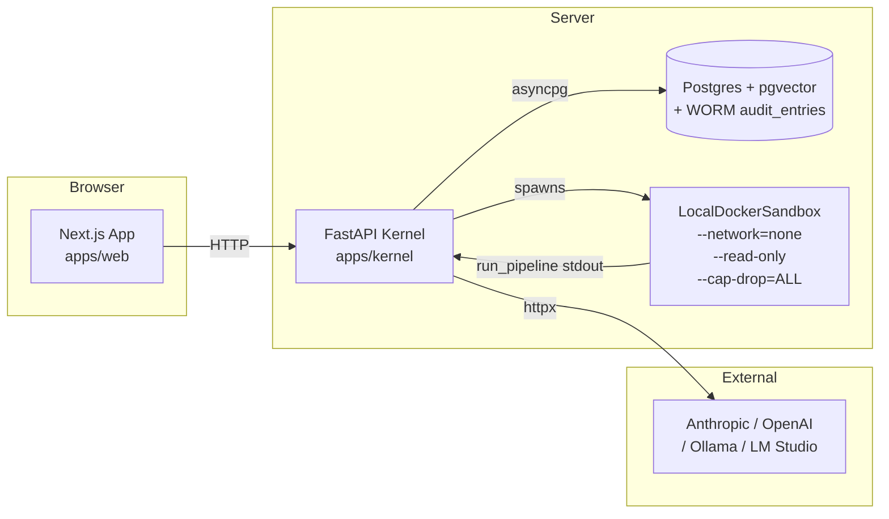
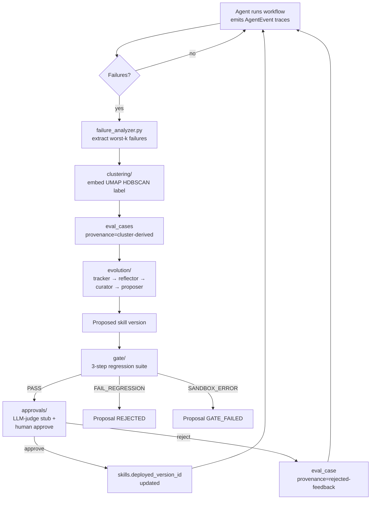
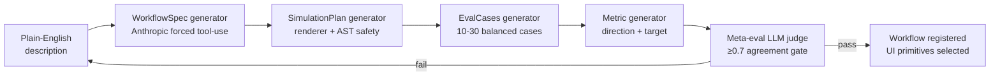
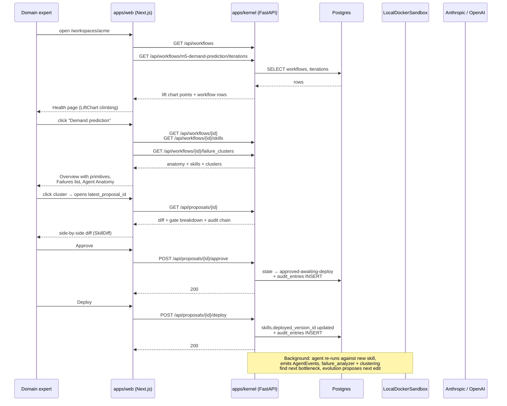

# ownEvo — Architecture

**Status:** living doc. Update whenever a structural change ships.
**Source of truth precedent:** when this doc disagrees with code, code wins; update this doc.

This is the one-document tour. For deep dives:

| Topic | Doc |
|---|---|
| Database schema | [`SCHEMA.md`](SCHEMA.md) (authoritative: `apps/kernel/migrations/0001_substrate.sql`) |
| Proposal / iteration state machines | [`STATE_MACHINES.md`](STATE_MACHINES.md) |
| Improvement-loop harness design rules | [`HARNESS.md`](HARNESS.md) |
| Multi-benchmark substrate (M5 + τ³) | [`BENCHMARK_ARCHITECTURE.md`](BENCHMARK_ARCHITECTURE.md) |
| Skill format + retention contract | [`SKILL_FORMAT.md`](SKILL_FORMAT.md) |
| AgentEvent trace schema | [`../packages/trace-format/SPEC.md`](../packages/trace-format/SPEC.md) |
| Build plan + sequencing | [`PLAN.md`](PLAN.md) |
| Deferred work | [`../TODOS.md`](../TODOS.md) |

---

## 1. Two processes, one seam

ownEvo is **two processes connected by REST + SSE.**



**Why two processes:** Python owns the core algorithms (improvement loop, eval harness, failure clustering, regression gate). TypeScript/Next owns the product surface (approval UX, diff viewer, lift chart, audit trail). The clustering ecosystem is Python-first at the quality bar required; the web UI is unavoidably TS/Next. Joining the two with REST + SSE keeps the boundary honest.

**Why Postgres + pgvector:** one substrate for relational state (workflows, skills, proposals, audit) AND vector search over failure embeddings. Avoids dual-write between OLTP and a vector store.

**Why local Docker sandbox:** agent-generated code runs there with the hardening listed above. Phase-2 swap to e2b / Modal is a one-file change behind the `SandboxRuntime` Protocol.

---

## 2. The improvement loop — the core engine

Every production failure becomes an eval case, every proposed fix is regression-tested against every prior fix, a domain expert approves changes in plain language.



**Key invariants:**
- Every state transition writes an `audit_entries` row (D2). Append-only at the DB level (`REVOKE UPDATE, DELETE` from the app role; only `INSERT` permitted).
- `eval_cases` are the durable substrate — they accumulate over time and define the regression suite. They are what makes the "every prior fix is regression-tested" claim load-bearing.
- The 3-step gate maps `FAIL_REGRESSION` and `FAIL_NO_IMPROVEMENT` to `ProposalState.REJECTED`; only `SANDBOX_ERROR` maps to `GATE_FAILED`. UI conditionals must check both.

---

## 3. NL-generation — describe → workflow

Domain experts type a description; the platform generates a runnable workflow.



The four artifacts are **discriminated unions**: each typed (Pydantic schemas in `packages/trace-format/` and `apps/kernel/src/ownevo_kernel/nl_gen/`), `extra="forbid"`, `frozen=True`. The seam is the schema; the prompts are best-effort.

The `WorkflowSpec.ui.tabs[].primitives[]` field declares which **render primitives** (MetricCards, TimeSeriesChart, etc.) the workspace should show — Track 0 of W8 makes those visible in the web app; layer D (TODO-35) closes the agent-output-to-render-data loop.

---

## 4. Trace format — the integration seam

`packages/trace-format/` defines a typed `AgentEvent` discriminated union. **Same role as OTel for distributed tracing** — standardize once, every downstream component works.

```mermaid
flowchart TB
  subgraph Customer agent<br/>any framework
    Code[code-generated agent]
  end
  Code -- emits --> AE[AgentEvent<br/>typed Pydantic]
  AE --> C[Trace collector<br/>apps/kernel/traces]
  C --> AN[failure_analyzer]
  C --> CL[clustering]
  C --> EV[evolution loop]
  C --> UI[Web app<br/>trace inspector]
```

Variants today: `ContentDelta`, `ReasoningDelta`, `ToolCallStart`, `ToolCallResult`, `SkillLoaded`, `Citation`, `MonitorSignal`. Spec at [`packages/trace-format/SPEC.md`](../packages/trace-format/SPEC.md).

---

## 5. End-to-end customer flow (today)

What a domain expert sees on a live workspace.



---

## 6. Module map — what lives where

```
apps/kernel/src/ownevo_kernel/
  api/                  FastAPI app + routes (proposals, skills, traces, workflows, audit, nl_gen)
  agent_tools/          read_skill / write_skill / run_pipeline / read_metrics / analyze_failures
  approvals/            state-machine service (gate-passed → approved → deployed)
  audit/                append-only audit writer (WORM enforced via DB trigger)
  benchmark/            M5BenchmarkRunner + LabourBenchmarkRunner + τ³ runner
  clustering/           embed (sentence-transformers) → reduce (UMAP) → cluster (HDBSCAN) → label (LLM)
  datasets/             M5 loader + WRMSSE metric
  eval_cases/           eval case registry + from_cluster promoter
  eval_runner/          agent solver (Anthropic + OpenAI paths) + nl_gen smoketest
  evolution/            tracker → reflector → curator → proposer
  gate/                 3-step regression / no-improvement / sandbox-error gate
  middleware/           Claude Agent SDK trace + tool plumbing + BL.3 compaction
  nl_gen/               NL → WorkflowSpec → SimulationPlan → EvalCases → Metric
  observability/        loop-stuck Slack alerter + learnings writer
  sandbox/              LocalDockerSandbox + SandboxRuntime Protocol
  skills/               skill registry + SKILL_FORMAT retention contracts
  traces/               trace collector

apps/web/app/
  workspaces/[wsId]/
    page.tsx                              Health dashboard (LiftChart + workflow rows)
    inbox/                                proposal queue
    audit/                                append-only audit trail viewer
    skills/                               Skills library (8.0.4)
    skills/[skillId]/                     per-skill detail + version history + LCS diff
    primitives/                           Views library — render-primitive showcase (8.0.1)
    workflows/[wfId]/                     per-workflow Overview, Failures, Traces, Audit tabs
    workflows/[wfId]/traces/[traceId]/    per-trace step inspection
    workflows/new/                        NL-gen storyboard (W5.5 → W8.0.5–6)
    proposals/[id]/                       proposal review (diff + gate + approve/deploy/rollback)
  components/
    primitives/                           9 leaf render components (Track 0)
    agent-anatomy.tsx                     three-column skills + tools + topology pane
    skill-diff.tsx                        LCS diff
  lib/
    api.ts                                kernel API client (typed)
    primitives-mock-data.ts               per-workflow mock resolver (Track 0 layer C)

packages/trace-format/                    AgentEvent + UIPrimitive Pydantic schemas + canonical SPEC.md
```

---

## 7. What is single-tenant for MVP (D4)

There is **no `workspace_id` column on any domain table** today. The `[wsId]` URL slug is cosmetic. Multi-tenant retrofit is `TODO-1`, a bounded 1-2 week job before next deployment, and the schema was designed retrofit-friendly. Do not add patterns that would fight a future `workspace_id` column.

---

## 8. Layered primitive architecture

Two distinct primitive layers, intentional:

**ownEvo platform primitives** (internal primitives):
- LiftChart (improvement-loop signal)
- FailureClusterCard
- AgentAnatomy pane
- ProposalDiff (SideBySide for skill versions)

**Workflow render primitives** (8.0.1–8.0.4):
- MetricCards, TimeSeriesChart, TableView, AlertList
- KanbanBoard, ScheduleGrid
- ConversationView, SideBySideView (clause-level), DocumentReader

Platform primitives drive the **improvement-loop surface** (what the platform tells the domain expert about the loop). Render primitives drive the **workflow operator surface** (what the operator sees when they use the workflow). NL-gen picks render primitives from the typed set when generating a workflow spec.

---

## 9. Known boundaries (not yet built)

- **Layer D resolver** (TODO-35): real agent output → primitive `source` field → typed render data. Today the resolver is hand-curated mocks. Phase-2 work.
- **Multi-tenant retrofit** (TODO-1): D4.
- **Sandbox provider migration** (TODO-2): e2b / Modal swap behind `SandboxRuntime` Protocol.
- **Audit-chain crypto upgrade** (TODO-3): content hash + parent hash + Merkle root + signed export. Reframed claim today is "append-only audit log, customer-controlled export" — not "tamper-evident hash chain".
- **τ³-bench condition C + prior-art reproduction** (PLAN W7.3.3 + 8.3.x).

Each has a TODO entry with motivation, effort, and dependency.
