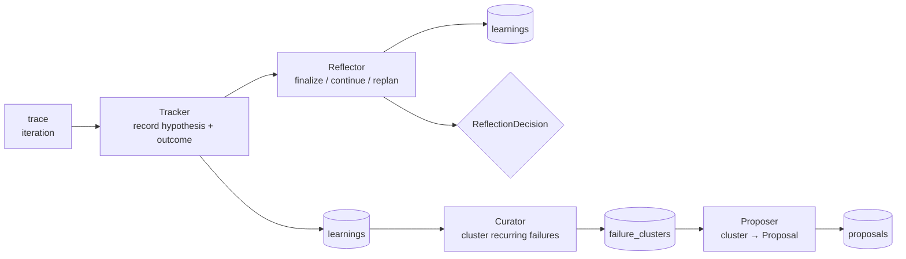

# Evolution Protocols — Tracker / Reflector / Curator / Proposer

**Authority:** when this doc disagrees with
`apps/kernel/src/ownevo_kernel/evolution/__init__.py`, the code wins —
update this doc to match.

The evolution module is the **proposer side of the improvement loop:**
it turns trace data into next-iteration proposals. Four typed Protocols
form the pipeline. This doc explains each stage's contract, what it
reads and writes, and where the concrete implementations live.

For the overall loop, see [`ARCHITECTURE.md`](ARCHITECTURE.md) §2 and
[`HARNESS.md`](HARNESS.md). This doc is the type-level companion to
those.

---

## 1. The pipeline



Four-stage shape inherited from the reference auto-harness, implemented
greenfield against ownEvo's substrate (`failure_clusters`, `eval_cases`,
`traces`, `proposals`) instead of the incident-management memory store
the reference used.

## 2. The Protocols

All four live in `evolution/__init__.py` as `Protocol` classes. Concrete
implementations live in sibling modules (`tracker.py`, `reflector.py`,
`curator.py`, `proposer.py`).

### `Tracker`

Records the agent's hypothesis + the observed outcome for an iteration.
Writes to the `learnings` table; readable by the loop-stuck alerter.

```python
class Tracker(Protocol):
    async def record_hypothesis(
        self,
        iteration_id: UUID,
        hypothesis: str,
    ) -> Learning: ...

    async def record_outcome(
        self,
        iteration_id: UUID,
        actual_outcome: str,
        success: bool,
    ) -> Learning: ...
```

| Field | Source |
|---|---|
| `iteration_id` | Iteration the hypothesis/outcome attaches to. |
| `hypothesis` | The proposer's textual rationale for the instruction edit. Stored verbatim. |
| `actual_outcome` | What the gate said happened (gate-pass / gate-blocked-no-improvement / sandbox-error). |
| `success` | Did the gate advance `best_ever`? |

### `Reflector`

Reviews one iteration and emits the next-step decision.

```python
class Reflector(Protocol):
    async def reflect(self, iteration: Iteration) -> ReflectionDecision: ...


class ReflectionDecision(StrEnum):
    FINALIZE = "finalize"
    CONTINUE = "continue"
    REPLAN   = "replan"
```

The decision drives the next iteration:

| Decision | When | Loop action |
|---|---|---|
| `FINALIZE` | Gate passed AND best-ever advanced. | The gate runner writes a new skill version; the proposed instruction ships (subject to approval mode). |
| `CONTINUE` | Gate passed but no improvement (`gate-blocked-no-improvement`). | Log to `learnings`; start next iteration with the same parent. |
| `REPLAN` | Gate blocked OR sandbox error. | Drop the current hypothesis; agent retries fresh. |

The concrete implementation also persists a `Learning` entry as a side
effect; the return value is what the loop runner acts on.

### `Curator`

Promotes recurring failure observations into named clusters.

```python
class Curator(Protocol):
    async def promote(self, workflow_id: str) -> list[FailureCluster]: ...
```

The pipeline (matches `clustering/` module):

1. Read failed-iteration trajectories from `traces`.
2. Embed via sentence-transformers (`EMBEDDING_DIM=384`).
3. Reduce via UMAP.
4. Cluster via HDBSCAN.
5. Label via LLM (one short cluster-name + rationale per cluster).
6. Insert into `failure_clusters` with a content `fingerprint` so re-runs are idempotent (see migration 0002).

The clustering layer enforces a **cluster-quality threshold:** if HDBSCAN
returns one mega-cluster or all-noise, the curator refuses to promote
and surfaces "more iterations needed" instead of seeding garbage
clusters. See `clustering/quality.py`.

### `Proposer`

Turns one failure cluster into a structured proposal for the gate.

```python
class Proposer(Protocol):
    async def propose(self, cluster: FailureCluster) -> Proposal: ...
```

Reads:
- The cluster's label, rationale, and representative failed traces.
- The current skill version (`skills.head_version_id` → `skill_versions`).
- The eval suite (`eval_cases`) for context on what passes today.

Emits a `Proposal` row in `state = PENDING`. The gate runner picks it up
on the next iteration and runs the 3-step regression suite against the
proposed skill version. See [`STATE_MACHINES.md`](STATE_MACHINES.md) §
proposals for the state diagram.

A future design (`D6` in the schema docs) adds `regression_gate` as a
`ProposalAction.action_type` so gate outcomes flow back through the
same proposal pipeline.

## 3. Data flow

For a single iteration that ends in failure:

```
trace (with metric_outputs.fold = "train")
  ↓
Tracker.record_hypothesis(iter_id, "I bumped duplicate threshold to 0.6")
  → learnings(kind='hypothesis', iteration_id=...)
  ↓
gate runs → gate_result: GATE_BLOCKED_NO_IMPROVEMENT
  ↓
Tracker.record_outcome(iter_id, "val_score=0.6 < best_ever=0.667", ...)
  → learnings(kind='observation', iteration_id=..., content=gate_result_summary)
  ↓
Reflector.reflect(iteration) → ReflectionDecision.CONTINUE
  → learnings(kind='observation', iteration_id=..., content="CONTINUE: no improvement")
  ↓
(next iteration runs; same parent skill_version)
  ...
(after several failed iterations)
  ↓
Curator.promote(workflow_id) → [FailureCluster("seed-7-duplicate-misses", ...)]
  → failure_clusters(fingerprint=..., label="seed-7-duplicate-misses")
  ↓
Proposer.propose(cluster) → Proposal(state=PENDING)
  → proposals(state=PENDING, action_type=SKILL_EDIT, ...)
```

## 4. Extension rules

If you add a new stage or a new implementation of an existing stage:

1. **Protocol stays in `__init__.py`.** Concrete implementations live in their own modules.
2. **All methods are async** — no exceptions. The pipeline runs inside the iteration runner's event loop.
3. **No direct table writes from outside the stage's owning module.** The proposer doesn't write to `learnings`; the tracker doesn't write to `proposals`. This is what makes the pipeline pluggable.
4. **Audit every state change.** Each stage that writes to a state-bearing table (`learnings`, `failure_clusters`, `proposals`) must also write a corresponding `audit_entries` row. See [`AUDIT_HARDENING.md`](AUDIT_HARDENING.md).
5. **Train/test discipline.** The proposer reads via `analyze_failures(..., include_test_fold=False)`. See [`TRAIN_TEST_DISCIPLINE.md`](TRAIN_TEST_DISCIPLINE.md).

## 5. Related code paths

| Need | Where to look |
|---|---|
| The proposer's prompt + LLM-tool-use plumbing | `evolution/proposer.py`, `middleware/claude_sdk/` |
| The reflector's decision rule (gate result → ReflectionDecision) | `evolution/reflector.py` |
| The curator's embed-reduce-cluster-label pipeline | `clustering/` |
| The trace pipeline that feeds the tracker | `traces/` and `eval_runner/` |
| The gate that consumes Proposals | `gate/` (see [`STATE_MACHINES.md`](STATE_MACHINES.md)) |
| The web UI that surfaces all of this | `apps/web/app/workspaces/[wsId]/workflows/[wfId]/` |

---

## Related docs

- [`ARCHITECTURE.md`](ARCHITECTURE.md) §2 — improvement loop overview
- [`HARNESS.md`](HARNESS.md) — harness design rules + the three-layers concept
- [`STATE_MACHINES.md`](STATE_MACHINES.md) — proposal + iteration state machines
- [`TRAIN_TEST_DISCIPLINE.md`](TRAIN_TEST_DISCIPLINE.md) — what proposer/curator may read
- [`MULTI_METRIC_GATE_GAP.md`](MULTI_METRIC_GATE_GAP.md) — proposed multi-metric gate the Proposer would need to satisfy
